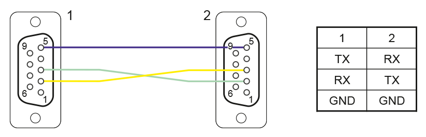

[](https://github.com/gunicsba/AOG_AGTronik_bridge/actions/workflows/build.yml)

# AOG-AgTronik Bridge

Bridge between **AgOpenGPS** and the **AvMap AgTronic** sprayer controller via the PAVPAGT serial protocol.

Supports bidirectional section control, speed forwarding, Auto/Manual mode feedback, and configurable section counts (5/7/9).

## Download

Grab the latest `AOG-AgTronik.exe` from [Releases](../../releases).

## Requirements

- Serial connection to the AvMap AgTronic (USB-to-Serial adapter)
- AgOpenGPS / AgIO broadcasting on UDP port 8888
- [RS-232 adapter](https://www.aliexpress.com/item/1005009141854353.html)
- AgOpenGPS / AgIO broadcasting on UDP port 8888

For development:
- Python 3.8+
- [pyserial](https://pypi.org/project/pyserial/) (`pip install pyserial`)

## Usage

Run `AOG-AgTronik.exe`. On first run you will be prompted to select a COM port.
The choice is saved to `config.ini` so subsequent runs connect automatically.

Press **X** to exit.

## Connection


Make your own cable as pin4 has 12V on Hardi and your USB-RS232 adapter might not like it!


## Features

| Feature | Description |
|---------|-------------|
| Bidirectional section control | Sends section ON/OFF commands to AgTronik; reports machine state back to AgOpenGPS |
| Auto mode | AgOpenGPS controls sections; disabled sections on AgTronik are forced off |
| Manual mode | AgTronik controls sections locally; state is reported back to AgOpenGPS |
| Master switch | ON/OFF state reported to AgOpenGPS; controls all sections |
| Speed forwarding | GPS speed from AgOpenGPS sent to AgTronik display |
| Section widths | Automatically read from machine and saved to config (AgOpenGPS doesn't support remote width) |
| Configurable section count | Supports 5, 7, or 9 section machine variants |
| Configurable rates | SCT and SPD command frequencies adjustable in config|
| Immediate section change | Section (SCT) commands sent instantly on change (no wait for next cycle) |
| Comms-lost safety | Sections zeroed when AgIO connection is lost |
| Auto-reconnect | 4-state machine handles connection loss and recovery |

## How It Works

```
 AgOpenGPS / Rate Controller          Bridge              AvMap AgTronic
 +--------------------------+    +---------------+    +------------------+
 |  Section control (Auto)  |--->| UDP :8888     |    |                  |
 |  Speed data              |    |               |--->| SCT (sections)   |
 |  Hello heartbeat         |    |  Serial TX    |    | SPD (speed)      |
 |                          |    |  115200 8N1   |    | WDT (probe)      |
 |  PGN 0xEA (sect data)   |<---|               |    | VER (version)    |
 |  PGN 0xED (from machine)|<---| UDP :9999     |    |                  |
 |  PGN32618 (switch box)  |<---|               |<---| SWT (switch sts) |
 |  Hello reply             |<---|  Serial RX    |<---| ACK              |
 +--------------------------+    +---------------+    +------------------+
```

## PAVPAGT Serial Protocol

- **Baud:** 115200, 8N1
- **Format:** `$PAVPAGT,<CMD>[,<args>]*<2-hex XOR checksum>\r\n`
- **Checksum:** XOR all ASCII bytes between `$` and `*` (exclusive)

### Commands (Bridge -> AvMap)

| Command | Purpose | Example | Rate | Description |
|---------|---------|---------|------|-------------|
| WDT | WiDTh | `$PAVPAGT,WDT*2E` | 1 Hz | Connection probe (handshake only) |
| VER | VERsion |`$PAVPAGT,VER*25` | once | Version query |
| SCT | SeCTion | `$PAVPAGT,SCT,1,1,0,0,0,1,1*XX` | configurable | Section states (0=off, 1=on) |
| SPD | SPeeD |`$PAVPAGT,SPD,125*XX` | configurable | Speed (km/h * 10) |

### Responses (AvMap -> Bridge)

| Response | Purpose | Example | Description |
|----------|---------|---------|-------------|
| SWT | SWiTch | `$PAVPAGT,SWT,A,1,0,0,0,0,0,1,1*55` | Mode + master + section states |
| VER | VERsion | `$PAVPAGT,VER,1.23*XX` | Firmware version |
| ACK | ACKnowledge | `$PAVPAGT,ACK,SCT*XX` | Command acknowledgement |
| WDT | WiDTh |`$PAVPAGT,WDT,0250,0250,...*XX` | Section widths in cm |

### SWT Fields

| Position | Field | Values |
|----------|-------|--------|
| 0 | Mode | `A` = Auto, `M` = Manual |
| 1 | Main switch | `0` = OFF, `1` = ON |
| 2..N | Sections | `0` = off/disabled, `1` = on/enabled |

## State Machine

```
DISCONNECTED ──[valid response]──> CONNECTED ──[VER response]──> READY ──[AgIO]──> RUNNING
     ^                                                                                 |
     └──────────────────────────── [3s timeout] ──────────────────────────────────────-┘
```

| State | Activity |
|-------|----------|
| DISCONNECTED | WDT probe at 1 Hz |
| CONNECTED | WDT + waiting for VER response |
| READY | Machine ready, waiting for AgIO connection |
| RUNNING | Sending SCT + SPD, receiving SWT |

## AgOpenGPS PGNs

### Outgoing to AgIO (port 9999)

| PGN | Description | Key bytes |
|-----|-------------|-----------|
| 0xEA (234) | Section Control Data | byte 5: main SW, bytes 9-12: relay ON/OFF |
| 0xED (237) | From Machine | bytes 5-6: relay lo/hi |
| 0x7B (123) | Hello Reply | bytes 5-6: relay lo/hi |
| 32618 | Switch Box | flags + section switch bitmask |

### PGN 0xEA Mode Behavior

| Mode | ON bytes (9, 11) | OFF bytes (10, 12) |
|------|------------------|--------------------|
| Auto | `0x00` (AGO controls) | Disabled sections bitmask |
| Manual | Active relay state | Inactive sections bitmask |

## config.ini

Created automatically on first run.

```ini
[main]
com = COM3
comms_lost_zero = 1
sections = 7
sct_hz = 1
spd_hz = 2
subnet = 255.255.255.255
section_widths = 250,250,250,300,250,250,250
```

| Parameter | Default | Description |
|-----------|---------|-------------|
| `com` | `0` (prompt) | Serial port. Set to `0` to prompt on startup |
| `comms_lost_zero` | `1` | Zero all sections when AgIO connection is lost |
| `sections` | `7` | Number of sections (5, 7, or 9) |
| `sct_hz` | `1` | Section command send rate in Hz |
| `spd_hz` | `2` | Speed command send rate in Hz |
| `subnet` | `255.255.255.255` | UDP broadcast address |
| `section_widths` | (auto) | Section widths in cm (read from machine) |

## Building

```bat
build.bat
```

Produces `AOG-AgTronik.exe` via PyInstaller.
